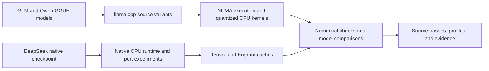

# Duck Duck Llama

**Engineering large-model inference on a four-socket CPU server.**

[](https://github.com/InfoSystemic/duck-duck-llama/actions/workflows/verify.yml)

Duck Duck Llama is a CPU inference engineering project covering NUMA execution, quantized kernels, speculative decoding, native model integration, and the measurements needed to connect an optimization to real model behavior.

The work follows **GLM-5.3 Full, GLM-5.3-Flash, Qwen3.8-Flash-Next, and DeepSeek-V4.1-Flash** on one real machine: four Xeon Gold 6242 sockets, 64 physical cores, 755 GiB of usable RAM, and no inference GPU. Source patches, runtime profiles, numerical checks, benchmark controllers, and unsuccessful experiments are retained together.

[Engineering case studies](docs/README.md#engineering-case-studies) · [Measured results](docs/results.md) · [Model guides](docs/models/README.md) · [Reproduce the work](docs/reproducing.md) · [Research archive](engineering/README.md)

## What the work demonstrates

| Engineering problem | Work delivered | Evidence |
| --- | --- | --- |
| Making four CPU sockets useful for inference | CPU-NUMA backend integration, tensor distribution, worker scheduling, collectives, and barrier experiments | GLM Flash Q8 raw decode reached **239.34–241.37 GB/s** of adjusted, counter-measured DRAM traffic in repeated controlled runs. [Case study](docs/case-studies/numa-and-bandwidth.md) |
| Improving kernels without losing numerical correctness | Quantized layouts, compact IQ paths, fused MoE operations, a corrected Qwen gather path, and exact-output regression fixtures | The corrected gather comparison retained identical output and reported **+3.94% prose / +2.50% code** mean decode gains. [Case study](docs/case-studies/quantization-and-layout.md) |
| Turning speculative decoding into a dependable serving feature | MTP integration, request-state reset and rollback work, draft-depth experiments, and reproducible comparisons | Retained Qwen Q6/Q8-MTP4 measurements: **21.53 prose / 28.46 code tok/s**, with workload and counter evidence. [Case study](docs/case-studies/speculative-decoding.md) |
| Bringing a native mixed-precision model onto CPUs | DeepSeek FP8/FP4 operators, Engram hashing and lookup, bounded stores, sparse-attention experiments, and an isolated llama.cpp port | **267,583,488 exact BF16 lookup comparisons**; a native CPU endpoint measured **1.800 tok/s on short, warm requests**. [Case study](docs/case-studies/native-deepseek.md) |

These are separate experiments with different workloads and precision settings. They are not a cross-model leaderboard. Generated-token rates can include reasoning; they do not establish completed-answer latency. [Measurement scope and limitations](docs/methodology.md).

## Inside the project



The documentation follows the engineering decisions. The archive preserves the detailed record behind them.

| Directory | Start here for |
| --- | --- |
| [docs/](docs/README.md) | Case studies, architecture, results, methodology, and model status |
| [tools/](tools/README.md) | Verification, archive search, quality probes, decode measurements, and low-level diagnostics |
| [profiles/](profiles/README.md) | Parameterized profiles and the later host-specific launch/rebuild recipes |
| [engineering/](engineering/README.md) | Dated source snapshots, complete engine patches, experiments, and evidence manifests |
| [patches/](patches/README.md) | Earlier integration patches, porting guidance, and upstream attribution |
| [benchmarks/](benchmarks/README.md) | Earlier benchmark reports and the conclusions later experiments refined |

## Explore it without model weights

On Linux with Python 3.12 and Bash:

```bash
git clone https://github.com/InfoSystemic/duck-duck-llama.git
cd duck-duck-llama
python3 tools/check_repository.py
python3 tools/search_archive.py engram --kind notes --limit 10
```

The repository check validates snapshot hashes, inherited artifact references, Python and shell syntax, documentation links, and the portable probe/controller tests. It does not start a model. CPU-specific kernel checks and full-model experiments have separate requirements, described in [reproduction](docs/reproducing.md).

For an existing server, the [tool guide](tools/README.md) explains how to run the quality and decode probes. To reconstruct an engine, use its exact public base and the matching source layers; complete engine patches represent alternative trees.

## Current engineering status

| Model | Demonstrated | Work still open |
| --- | --- | --- |
| [GLM-5.3 Full](docs/models/glm-full.md) | Historical mixed-precision/MTP inference; tensor-split alignment correction checked across 57,888 metadata cases and built as an isolated library | Recent loads fail on NUMA node 3 under the current RAM-cache footprint; the corrected unequal split needs a full-model trial |
| [GLM-5.3-Flash](docs/models/glm-flash.md) | Repeated Q8 raw/MTP measurements, Q4 serving work, and durable launcher/library recipes | Fresh comparisons for the newest tuning recipes and larger-context validation |
| [Qwen3.8-Flash-Next](docs/models/qwen-flash-next.md) | Q6/MTP inference, gather and request-state fixes, repeated output/counter comparisons | Fresh A/B/A validation of the latest unary/ngram recipe; broader quality evaluation |
| [DeepSeek-V4.1-Flash](docs/models/deepseek-v41.md) | Native short-context CPU inference and extensive exact component checks | Practical cold-cache behavior, broad generation quality, validated 4K/16K context, and full-checkpoint execution in the new engine port |

Status describes the recorded engineering evidence, not a promise that a particular endpoint is running now. The four-model optimization program remains active. [Roadmap](docs/roadmap.md).

## Research principles

- **Correctness precedes speed.** A faster kernel must preserve the intended arithmetic and survive a model-level comparison.
- **Measure at the right level.** Hardware counters, decode timing, wall time, and component profiles answer different questions.
- **Keep the controls.** Drift, cache reuse, output divergence, and failed promotions remain visible in the evidence.
- **Make provenance inspectable.** Exact source bases, patch reconstruction, configuration, and validation scope travel with the result.

This repository publishes engineering artifacts, not model weights or compiled model runtimes. Host-specific recipes preserve the original machine paths; they require adaptation elsewhere.

## Attribution and contributions

Maintained by [InfoSystemic](https://github.com/InfoSystemic). The project builds on llama.cpp, GGML, model publishers, and named upstream contributors. Local optimization and integration work is distinguished from upstream model support in the [provenance guide](docs/provenance.md) and [patch attribution](patches/ATTRIBUTION.md).

Original project material is available under the [MIT license](LICENSE); imported material retains its own notices. Model licenses apply separately. See [CONTRIBUTING.md](CONTRIBUTING.md) for the evidence expected with an optimization.
